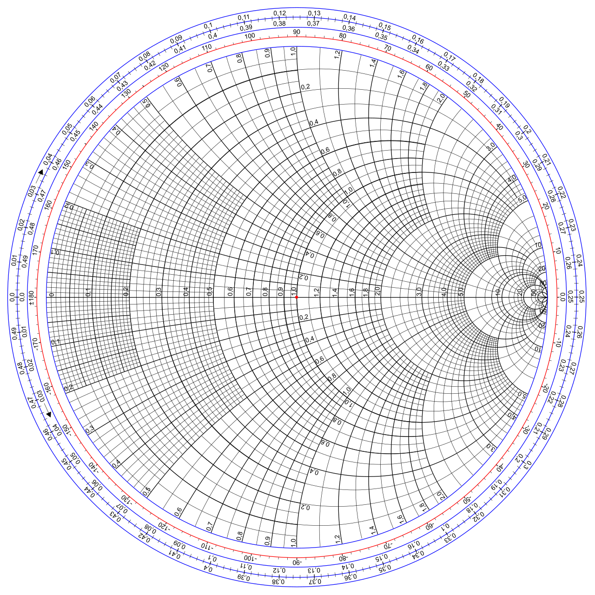

# Đánh giá hiệu năng của giao thức truyền thông LoRa trong nhiều môi trường

## Phần 1. Tổng quan đề tài

Trong bối cảnh Cách mạng công nghiệp 4.0 và sự bùng nổ của Internet vạn vật (IoT), các công nghệ truyền thông không dây công suất thấp tầm xa (LPWAN) ngày càng đóng vai trò quan trọng trong việc xây dựng các hệ thống kết nối bền vững, tiết kiệm năng lượng và triển khai linh hoạt trong nhiều lĩnh vực như công nghiệp, nông nghiệp, giao thông và đô thị thông minh. Trong số đó, LoRa nổi bật nhờ khả năng phủ sóng rộng, tiêu thụ điện năng thấp và phù hợp với nhiều kịch bản ứng dụng thực tế. Xuất phát từ nhu cầu đánh giá tính ổn định và giới hạn truyền dẫn của LoRa trong điều kiện môi trường khác nhau, nhóm thực hiện đề tài khảo sát và đo đạc chất lượng liên kết thông qua các chỉ số RSSI và SNR tại nhiều khoảng cách, từ đó phân tích ảnh hưởng của cấu hình truyền (BW, SF, công suất phát,...) và điều kiện địa hình đến hiệu năng hệ thống, nhằm cung cấp cơ sở tham khảo cho việc lựa chọn tham số và triển khai các giải pháp IoT hiệu quả trong thực tế.

## Phần 2. Cơ sở lý thuyết

### 1. Giới thiệu về công nghệ truyền thông Lora

LoRa (Long Range) là công nghệ truyền thông vô tuyến không dây cho phép các thiết bị trao đổi dữ liệu ở khoảng cách xa nhưng vẫn duy trì mức tiêu thụ năng lượng rất thấp, nhờ đó đặc biệt phù hợp với các hệ thống IoT chạy pin, triển khai ở khu vực khó tiếp cận hoặc không có nguồn điện ổn định. Công nghệ này sử dụng kỹ thuật điều chế dựa trên Chirp Spread Spectrum (CSS), trong đó dữ liệu được mã hóa bằng các xung “chirp” có tần số biến thiên theo thời gian, giúp tăng khả năng chống nhiễu, cải thiện độ tin cậy và duy trì liên kết tốt ngay cả trong môi trường truyền dẫn không lý tưởng. LoRa thường hoạt động trên các dải tần sub-GHz không cần cấp phép như 433 MHz, 868 MHz hoặc 915 MHz (thuộc băng tần ISM), và cũng có thể triển khai ở 2.4 GHz để đạt tốc độ cao hơn nhưng đánh đổi bằng phạm vi phủ sóng ngắn hơn. Với ưu thế truyền xa, bền vững trước nhiễu và phù hợp cho các gói dữ liệu nhỏ tốc độ thấp, LoRa trở thành lựa chọn lý tưởng cho mạng cảm biến, thiết bị giám sát và các ứng dụng cần vận hành lâu dài với năng lượng hạn chế.

### 2. Anten và các thông số của anten

Trong lĩnh vực tần số vô tuyến (RF) và vi sóng (microwave), việc truyền tín hiệu điện giữa các thiết bị qua không gian đóng vai trò then chốt. Anten là thành phần quan trọng, vừa phát vừa thu sóng điện từ. Để anten hoạt động hiệu quả, cần nắm vững các thông số đặc trưng của anten, bao gồm trở kháng đầu vào, độ phản xạ, hệ số truyền, cũng như khả năng phối hợp trở kháng với đường truyền.

#### 2.1. Các loại anten

*Hình 1. Các loại anten thường gặp*

#### 2.2. Các tham số của anten

##### 2.2.1. Tham số $S_{11}$

Với một hệ thống hai cổng (2-port), ma trận S bao gồm bốn phần tử chính là $S_{11}$, $S_{12}$, $S_{21}$ và $S_{22}$, lần lượt đại diện cho các đặc tính phản xạ và truyền dẫn của hệ thống. Trong đó, $S_{11}$ là hệ số phản xạ tại cổng vào, $S_{21}$ là hệ số truyền thuận từ cổng vào sang cổng ra, $S_{12}$ là hệ số truyền ngược từ cổng ra về cổng vào, và $S_{22}$ là hệ số phản xạ tại cổng ra. Nhờ các tham số này, người thiết kế có thể đánh giá được mức độ suy hao, mức truyền năng lượng và sự phù hợp trở kháng của hệ thống.
	
Riêng đối với tham số $S_{11}$, đây là một trong những chỉ tiêu quan trọng nhất khi đánh giá mức độ phối hợp trở kháng của anten. Tham số này phản ánh lượng năng lượng bị phản xạ trở lại tại cổng vào, nguyên nhân chủ yếu đến từ sự không phù hợp trở kháng giữa anten và đường truyền (thường chuẩn hóa ở $50\Omega$).

##### 2.2.2. Đồ thị Smith

Đồ thị Smith (Smith Chart) là một công cụ đồ họa quan trọng trong lĩnh vực RF – vi ba, được sử dụng để biểu diễn trở kháng phức và hệ số phản xạ của mạch cao tần. Nhờ khả năng thể hiện trực quan quá trình phản xạ và phối hợp trở kháng, đồ thị Smith giúp kỹ sư dễ dàng đánh giá mức độ khớp trở giữa anten và đường truyền, từ đó tối ưu hiệu suất truyền năng lượng.

*Hình 2. Đồ thị Smith*

## Phần 3. Hệ thống phần cứng

## Phần 4. Kết quả thực nghiệm